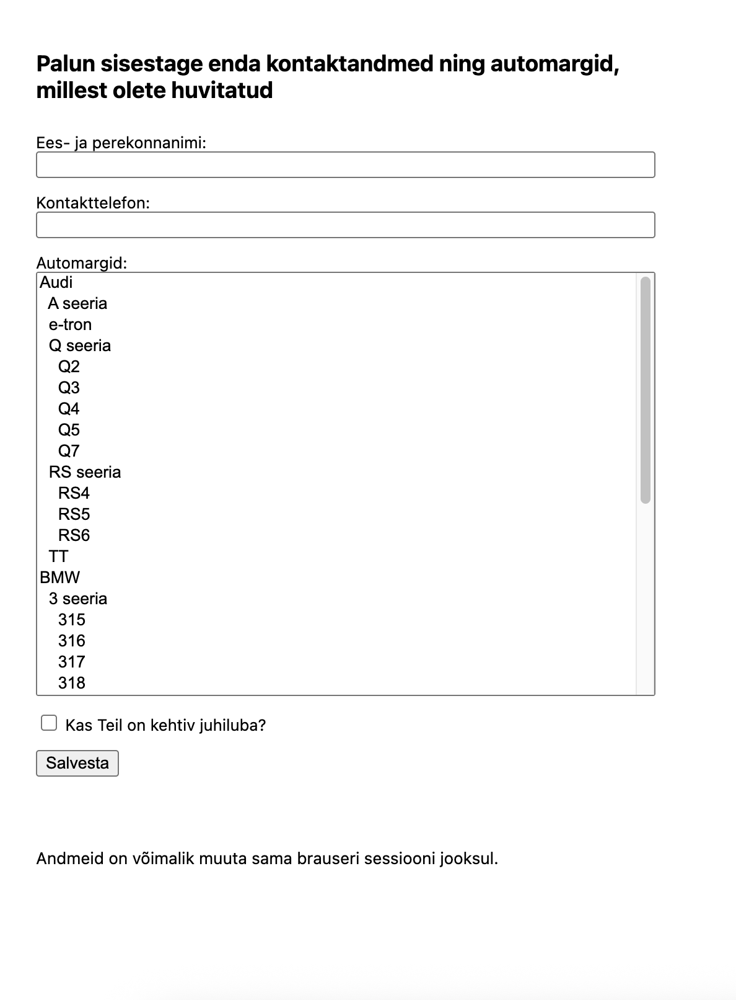

# FormulaTree

FormulaTree is a simple web application for collecting user contact details and their preferred car brands.

The application models car brands as a hierarchical tree structure and allows users to select multiple options, save their data, and update it within the same session.

## Tech Stack

* Java 21
* Spring Boot
* Spring Data JPA
* PostgreSQL
* Docker
* Vanilla JavaScript

## Running the Application

### 1. Start the database

```bash
docker compose up -d
```

### 2. Run the application

```bash
./gradlew bootRun
```

The application will be available at:

```
http://localhost:8080
```
## Features

* Hierarchical car options loaded from database
* Options displayed as indented tree and sorted alphabetically
* Form validation (all fields required)
* Data stored in PostgreSQL
* User can update submission within same browser session

## Database

Tables:

* car_option – hierarchical structure
* submission – user data
* submission_car_option – relation table

Database dump included in project.

## Time estimate
Estimated time: ~14 hours

## Feedback
The task is clear and well-structured.

One ambiguity:
* Behavior of selecting parent car options (should children be auto-selected or not)

## Screenshots

